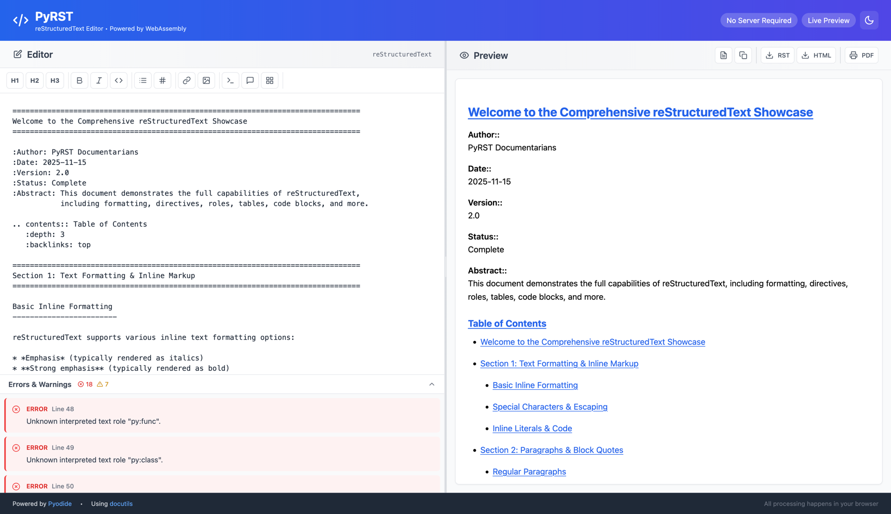

PyRST Documentation
===================

A WebAssembly-powered reStructuredText editor using Pyodide and docutils.

PyRST is a client-side web application that runs Python code in the browser using WebAssembly (via Pyodide).
The application processes reStructuredText markup and converts it to HTML without any server-side processing.

Features
--------

* **Live Preview**: Instant HTML rendering as you type
* **Client-Side Processing**: All processing happens in your browser
* **Full RST Support**: Comprehensive rendering of RST elements
* **Error Detection**: Real-time syntax checking with line highlighting
* **Export Options**: Copy or download as RST, HTML, or PDF
* **Resizable Panels**: Customizable workspace layout
* **Zero Build Step**: No transpilation or compilation required

Quick Start
-----------

Visit `pyrst.dev <https://pyrst.dev>`_ to start using the editor immediately.

Documentation Contents
----------------------

.. toctree::
   :maxdepth: 2
   :caption: User Guide

   features
   toolbar

.. toctree::
   :maxdepth: 2
   :caption: Development

   architecture
   api
   development

Indices and tables
------------------

* :ref:`genindex`
* :ref:`modindex`
* :ref:`search`